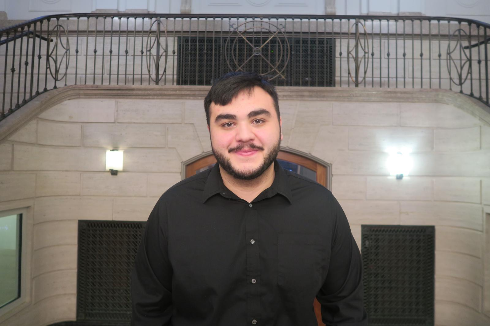

## About Me

My name is Marcos Martinez, and I am a Mechanical Engineering student at Cornell University passionate about designing, building, and testing mechanical systems for aerospace and robotics applications. My experience spans from developing high-performance quadcopters, where I applied aerodynamics and structural mechanics principles to optimize flight stability and durability, to leading the design of a scout drone that supports autonomous Mars rover missions. Within Cornell’s Space Domain Awareness Laboratory, I am implementing a cold-gas propulsion system for spacecraft attitude control, working directly on thruster placement, nozzle performance, and system integration. I thrive in hands-on environments that combine CAD modeling, rapid prototyping, and  machining, and I am motivated by the challenge of turning mechanical concepts into reliable hardware for real-world mission applications.

Aenean tincidunt aliquam arcu, in euismod dui dapibus eu. In placerat, mi et ultrices consequat, quam ligula cursus mauris, in semper neque nibh at est. Maecenas hendrerit dignissim porta. Phasellus nec fringilla dolor. Etiam efficitur nisi sit amet velit pharetra feugiat. Etiam ultrices turpis at leo semper, eleifend scelerisque neque malesuada. Aliquam molestie congue rhoncus. Donec blandit neque dolor, nec tristique mi pretium ac. Mauris tincidunt ullamcorper magna, nec pellentesque mi sagittis quis.

Take a look at <a href="{{ "/projects/" | relative_url }}">my projects</a> and <a href="{{ "/cv/" | relative_url }}">CV</a>.
